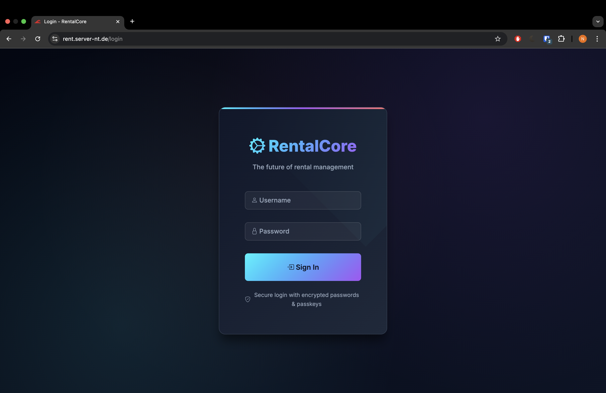
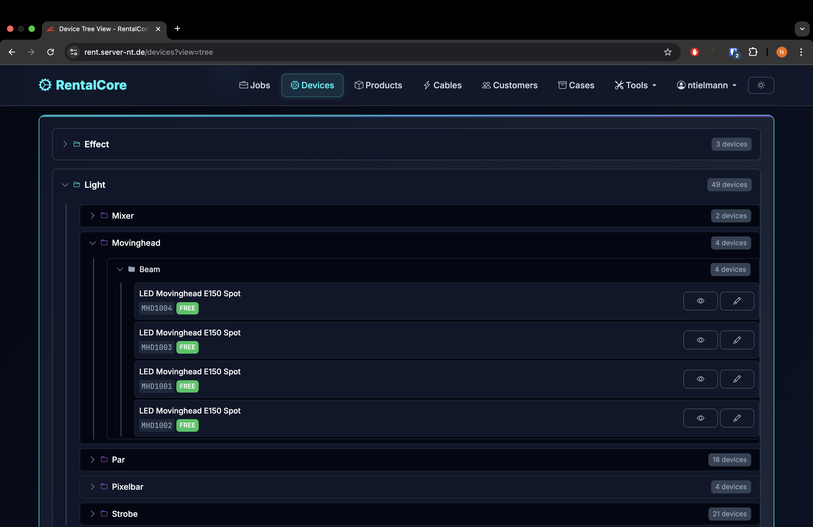
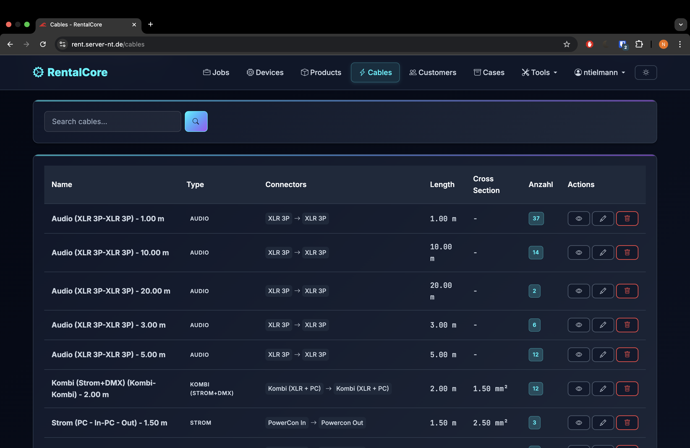
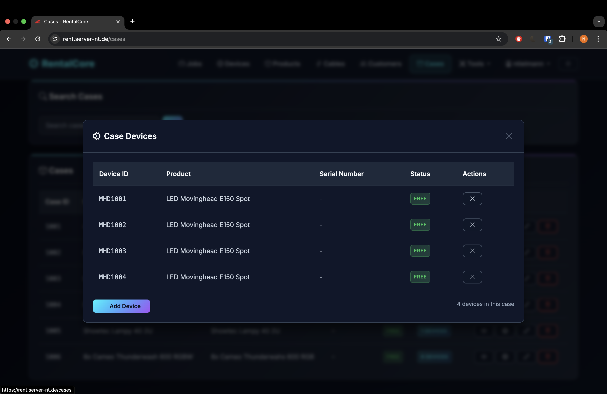

# 🎯 RentalCore - Professional Equipment Rental Management System

A comprehensive, enterprise-grade equipment rental management system built with Go, featuring advanced analytics, device tracking, and customer management. Designed for exclusive Docker deployment with professional theming and modern web interface.

## 📑 Table of Contents

- [✨ Key Features](#-key-features)
- [🚀 Quick Start](#-quick-start-docker-deployment)
- [🏗️ Project Architecture](#️-project-architecture)
- [🔧 Configuration](#-configuration-management)
- [📊 API Documentation](#-api-documentation)
- [🔐 Security](#-security-features)
- [🚀 Deployment](#-production-deployment)
- [📈 Performance](#-performance--scaling)
- [🛠️ Development](#️-development)
- [📝 Documentation](#-documentation)
- [📱 Responsive Design](#-responsive-design)
- [📷 Demo Images](#-demo-images)
- [🏷️ Version History](#️-version-history)
- [📧 Support](#-support--contact)

## ✨ Key Features

### 📊 **Advanced Analytics Dashboard**
- **Real-time Analytics**: Revenue trends, equipment utilization, customer metrics
- **Interactive Charts**: Chart.js integration with responsive visualizations  
- **Device Analytics**: Individual device performance with detailed insights modal
- **Time Period Filtering**: 7 days, 30 days, 90 days, 1 year analysis
- **Export Functionality**: PDF and CSV export with UTF-8 encoding
- **Performance Metrics**: Utilization rates, booking statistics, revenue analysis

### 🏢 **Equipment Management**
- **Product Catalog (WarehouseCore)**: Manage product master data exclusively in WarehouseCore (`/admin/products`); RentalCore consumes the catalog read-only for jobs, invoices, and device assignments
- **Device Management (WarehouseCore)**: Full device CRUD operations now managed exclusively in WarehouseCore (`/admin/devices`); RentalCore provides read-only device access for job assignments, invoices, and analytics
- **Cable Management (WarehouseCore)**: Complete cable CRUD operations now managed exclusively in WarehouseCore (`/admin/cables`); includes cable types, connectors, and length specifications
- **Case Management (WarehouseCore)**: Complete case CRUD operations now managed exclusively in WarehouseCore (`/admin/cases`); includes device mapping, labels, and case tracking
- **Availability Tracking**: Real-time device status integration from WarehouseCore (available, checked out, maintenance)
- **QR Code & Barcode Generation**: Device identification codes now managed in WarehouseCore
- **Bulk Operations**: Mass device assignment and status updates
- **Equipment Packages**: Predefined equipment bundles for common rentals
- **Revenue Tracking**: Per-device revenue analytics and performance insights
- **🆕 Rental Equipment System**: External equipment rental tracking with supplier management
- **🆕 Manual Entry & Selection**: Add external rentals directly to jobs or select from catalog
- **🆕 Rental Analytics**: Dedicated analytics for external equipment usage and costs

### 👥 **Customer & Job Management**
- **Customer Database**: Comprehensive customer information with rental history
- **Job Lifecycle**: Complete job management from creation to completion
- **Automatic Job Codes**: Consistent `JOB000123` style identifiers generated for every job
- **Enhanced Job Modals**: Revenue and device count display with detailed overview
- **Product-Based Assignment**: Build job manifests by selecting products with live availability checks; RentalCore resolves device allocations automatically
- **Device Price Management**: Real-time price adjustment per job with API integration
- **Categorized Device Overview**: Devices grouped by Sound, Light, Effect, Stage, Other
- **Invoice Generation**: Professional invoice creation with customizable templates
- **Status Tracking**: Real-time job status updates with audit trails

### 💼 **Professional Features**
- **RentalCore Design System**: Professional dark theme with consistent branding
- **🆕 Fully Responsive Design**: Complete mobile-first responsive implementation
  - **Mobile Navigation**: Drawer-style navigation with backdrop and touch optimization
  - **Tablet Interface**: Icon rail navigation with compact layouts
  - **Desktop Experience**: Full sidebar with comprehensive layouts
  - **Responsive Tables**: Card transformation for mobile, horizontal scroll with sticky columns
  - **Adaptive Forms**: Single-column mobile, multi-column desktop with responsive grids
  - **Touch-Optimized**: 44px minimum touch targets, enhanced focus states
- **🆕 Personalized Dashboard Widgets**: User-level control over homepage metrics with quick links to core modules
- **PWA Support**: Progressive Web App features for mobile deployment
- **Multi-language Support**: Internationalization ready
- **Document Management**: File upload, signature collection, document archival

### 🔐 **Security & Administration**  
- **User Management**: Role-based access control with security audit logs
- **2FA Authentication**: Two-factor authentication with WebAuthn support
- **Encryption**: Industry-standard data encryption and secure key management
- **GDPR Compliance**: Privacy controls and data retention management
- **Security Monitoring**: Real-time security event tracking and alerting

### 📈 **Business Intelligence**
- **Financial Dashboard**: Revenue tracking, payment monitoring, tax reporting
- **Performance Monitoring**: System metrics, error tracking, health checks
- **Audit Logging**: Comprehensive activity logging for compliance
- **Backup Management**: Automated data backup with retention policies

## 🚀 Quick Start (Docker Deployment)

### Prerequisites
- Docker Engine 20.10+
- Docker Compose 2.0+
- External MySQL/MariaDB database
- Domain with SSL certificate (production)

### 1. Get Configuration Files
```bash
git clone https://git.server-nt.de/ntielmann/rentalcore.git
cd RentalCore

# Or download configuration files directly
wget https://git.server-nt.de/ntielmann/rentalcore/raw/main/docker-compose.example.yml
wget https://git.server-nt.de/ntielmann/rentalcore/raw/main/.env.example
wget https://git.server-nt.de/ntielmann/rentalcore/raw/main/config.json.example
```

### 2. Configure Environment
```bash
# Copy and configure environment variables
cp .env.example .env
nano .env  # Edit with your database credentials

# Copy and configure application settings  
cp config.json.example config.json
nano config.json  # Customize application settings

# Copy and configure Docker Compose
cp docker-compose.example.yml docker-compose.yml
nano docker-compose.yml  # Adjust for your environment
```

### 3. Deploy

**🎉 On a fresh system, the database is automatically initialized!**

The `RentalCore.sql` file is automatically imported when you start the stack for the first time. No manual database setup required!

```bash
# Start the application (database auto-initializes on first run)
docker-compose up -d

# Check status
docker-compose ps
docker-compose logs -f rentalcore

# Wait for MySQL to initialize (first run takes ~30 seconds)
# Watch the logs to see when initialization is complete
docker-compose logs -f mysql

# Access the application
open http://localhost:8081
```

**📝 How Auto-Initialization Works:**
- On **first start**, MySQL automatically imports `/opt/dev/cores/RentalCore.sql`
- The database schema and default admin user are created automatically
- This only happens when the `mysql-data` volume is empty (fresh install)

**🔄 To Reset Database (Fresh Install):**
```bash
# Stop and remove volumes (⚠️ DELETES ALL DATA!)
docker-compose down -v

# Start again (triggers fresh database init)
docker-compose up -d
```

**⚠️ Common Issues on Fresh System:**

1. **Restart Loop on First Start?**
   - **Normal!** MySQL needs 60-90 seconds to import the database
   - Wait and monitor: `docker-compose logs -f mysql`
   - Once you see "ready for connections", services will start automatically

2. **Can't Login with admin/admin?**
   - You likely have an existing MySQL volume from a previous install
   - **Solution:** `docker-compose down -v` then `docker-compose up -d`
   - This will delete all data and reinitialize the database

3. **Services Won't Start?**
   - Check logs: `docker-compose logs --tail=100`
   - Pull images: `docker-compose pull`
   - Check ports: `sudo lsof -i :8081 :3306`

**📖 Detailed Troubleshooting:** See [DEPLOYMENT_GUIDE.md](../DEPLOYMENT_GUIDE.md) for complete deployment instructions and troubleshooting.

### 🔑 Default Login Credentials

The admin user is **automatically created** on first database initialization:

- **Username:** `admin`
- **Password:** `admin`
- **Email:** `admin@localhost`
- **Roles:** `super_admin`, `admin`, `warehouse_admin`

**⚠️ IMPORTANT:** The default admin is now forced to change the password on the very first login before the dashboard can be accessed.

**Default roles provisioned by the schema:**

| Role | Scope | Description |
|------|-------|-------------|
| `super_admin` | Global | Full access across RentalCore + WarehouseCore |
| `admin` | RentalCore | Complete RentalCore administration |
| `manager` | RentalCore | Jobs, customers, devices management |
| `operator` | RentalCore | Operational flows incl. scanning |
| `viewer` | RentalCore | Read-only |
| `warehouse_admin` | Warehouse | Full warehouse administration |
| `warehouse_manager` | Warehouse | Warehouse operations + reporting |
| `warehouse_worker` | Warehouse | Day-to-day warehouse scanning/tasks |
| `warehouse_viewer` | Warehouse | Read-only warehouse access |

### 🔄 Integrated Deployment with WarehouseCore

For integrated deployment of both RentalCore and WarehouseCore together, use the root docker-compose configuration:

```bash
# Navigate to the parent directory (NOT a git repo)
cd /opt/dev/lager_weidelbach

# Pull latest images from Docker Hub
docker compose pull

# Start both services
docker compose up -d

# Check status
docker compose ps

# View logs
docker compose logs -f rentalcore
docker compose logs -f warehousecore
```

**Access the applications:**
- **RentalCore**: http://localhost:8081
- **WarehouseCore**: http://localhost:8082

**Cross-navigation:**
Both applications feature navbar links to seamlessly switch between RentalCore and WarehouseCore with a single click.

**Note:** The images use `:latest` tags. Pull periodically to get the newest versions:
```bash
docker compose pull && docker compose up -d
```

## 🏗️ Project Architecture

### 📁 **Directory Structure**
```
rentalcore/
├── cmd/server/              # Application entry point
├── internal/
│   ├── handlers/           # HTTP request handlers
│   ├── models/             # Database models and structures
│   ├── services/           # Business logic services
│   └── middleware/         # HTTP middleware
├── web/
│   ├── templates/          # HTML templates with modern design
│   └── static/            # CSS, JavaScript, assets
├── migrations/             # Database migration scripts
├── keys/                   # SSL certificates and keys
├── logs/                   # Application logs
├── uploads/               # User uploaded files
├── docker-compose.yml      # Docker deployment configuration
├── .env                   # Environment variables (not in repo)
├── config.json            # Application configuration (not in repo)
├── .gitignore             # Git ignore rules with credential protection
└── README.md              # This documentation
```

### 🛠️ **Technology Stack**
- **Backend**: Go 1.23+ with Gin web framework
- **Database**: MySQL 8.0+ with GORM ORM
- **Frontend**: HTML5, Bootstrap 5, Chart.js, vanilla JavaScript
- **Authentication**: WebAuthn, 2FA, session management
- **Deployment**: Docker with health checks and volume management
- **Monitoring**: Prometheus metrics, structured logging
- **Security**: TLS encryption, CORS protection, input validation

## 🔧 Configuration Management

### **Environment Variables (.env)**
```bash
# Database Configuration
DB_HOST=your-database-host.com
DB_PORT=3306
DB_NAME=rentalcore
DB_USERNAME=rentalcore_user
DB_PASSWORD=secure_password

# Security Settings
ENCRYPTION_KEY=your-256-bit-encryption-key
SESSION_TIMEOUT=3600
GIN_MODE=release

# Optional: Email Configuration
SMTP_HOST=smtp.yourdomain.com
SMTP_PORT=587
SMTP_USERNAME=noreply@yourdomain.com
SMTP_PASSWORD=email_password
```

### **Application Configuration (config.json)**
- **UI Theming**: Professional dark theme with customizable colors
- **Feature Flags**: Enable/disable specific functionality
- **Performance Settings**: Cache timeouts, connection pooling
- **Invoice Configuration**: Tax rates, payment terms, currency settings
- **Security Policies**: Password requirements, session management

## 📊 API Documentation

### **Analytics Endpoints**
- `GET /analytics` - Main analytics dashboard
- `GET /analytics/devices/:deviceId` - Individual device analytics
- `GET /analytics/devices/all` - All device revenue data
- `GET /analytics/export` - Export analytics data (PDF/CSV)

### **Core Management APIs**
- `GET|POST|PUT|DELETE /api/v1/jobs` - Job management
- `GET /api/v1/devices` - Device inventory (read-only)
- `GET /api/v1/devices/:id` - Device details (read-only)
- `GET /api/v1/devices/available` - Available devices for assignment
- `GET /api/v1/devices/available/job/:jobId` - Availability scoped to a job
- `GET /api/v1/devices/tree/availability` - Hierarchical availability view
- `POST|PUT|DELETE /api/v1/devices` - **410 Gone** (use WarehouseCore for write operations)
- `GET|POST|PUT|DELETE /api/v1/customers` - Customer database
- `GET|POST|PUT|DELETE /api/v1/invoices` - Invoice management

### **Utility Endpoints**
- `GET /health` - Application health check
- `POST /search/global` - Global search functionality
- `GET /monitoring/metrics` - Prometheus metrics

## 🔐 Security Features

### **Authentication & Authorization**
- Multi-factor authentication (2FA, WebAuthn)
- Role-based access control (RBAC)
- Session management with secure cookies
- Password policy enforcement

### **Data Protection**
- Industry-standard encryption (AES-256)
- HTTPS/TLS termination
- Input validation and sanitization
- SQL injection prevention
- CSRF protection

### **Compliance & Auditing**
- GDPR compliance features
- Comprehensive audit logging
- Data retention policies
- Security event monitoring

## 🚀 Production Deployment

### **Docker Hub Images**
```bash
# Latest stable release
docker pull nbt4/rentalcore:latest

# Specific version
docker pull nbt4/rentalcore:1.4
```

### **Reverse Proxy Integration**
```yaml
# Traefik labels example
labels:
  - "traefik.enable=true"
  - "traefik.http.routers.rentalcore.rule=Host(`rental.yourdomain.com`)"
  - "traefik.http.services.rentalcore.loadbalancer.server.port=8080"
  - "traefik.http.routers.rentalcore.tls.certresolver=letsencrypt"
```

### **Monitoring & Maintenance**
```bash
# Health check
curl https://rental.yourdomain.com/health

# View logs
docker-compose logs -f --tail=100 rentalcore

# Update deployment
docker-compose pull && docker-compose up -d

# Backup data
docker run --rm -v rentalcore_uploads:/data -v $(pwd):/backup alpine tar czf /backup/backup.tar.gz /data
```

## 📈 Performance & Scaling

### **Optimization Features**
- Database connection pooling (50 connections default)
- Response caching for analytics data
- Lazy loading for large datasets
- Image optimization and compression
- Minified CSS/JavaScript assets

### **Monitoring Metrics**
- Application performance monitoring (APM)
- Database query performance
- Memory and CPU utilization
- Error rate and response time tracking
- User activity analytics

## 🛠️ Development

### **Local Development Setup**
```bash
# Clone repository
git clone https://git.server-nt.de/ntielmann/rentalcore
cd RentalCore

# Copy configuration examples
cp .env.example .env
cp config.json.example config.json

# Build and run
go mod tidy
go build -o server ./cmd/server
./server

# Or use Docker for development
docker-compose up -d --build
```

### **Contributing**
1. Fork the repository
2. Create feature branch (`git checkout -b feature/amazing-feature`)
3. Commit changes (`git commit -m 'Add amazing feature'`)
4. Push to branch (`git push origin feature/amazing-feature`)
5. Open a Pull Request

## 📝 Documentation

All documentation is organized in the `docs/` folder for easy access:

### Core Documentation
- **[Database Setup Guide](docs/DATABASE_SETUP.md)** - Complete database installation and configuration guide

### Deployment Guides
- **[Docker Deployment](docs/DOCKER_DEPLOYMENT.md)** - Comprehensive deployment instructions
- **[Quick Start Guide](docs/DOCKER_QUICK_START.md)** - Rapid deployment guide
- **[Configuration Examples](docs/CONFIGURATION.md)** - Environment and config examples

### Technical Documentation
- **[API Reference](docs/API.md)** - Complete API documentation
- **[Security Guide](docs/SECURITY.md)** - Security best practices and features
- **[Architecture Guide](docs/ARCHITECTURE.md)** - System architecture and design patterns

### User Guides
- **[User Manual](docs/USER_GUIDE.md)** - Complete user documentation
- **[Admin Guide](docs/ADMIN_GUIDE.md)** - Administrator documentation
- **[Troubleshooting](docs/TROUBLESHOOTING.md)** - Common issues and solutions

## 🏷️ Version History

### **v2.62** (Latest) - Theme-Aligned Product Tree
- ✅ **Unified Look & Feel**: Reworked product tree containers, chips, and cards to reuse RentalCore’s surface palette and spacing scale
- ✅ **Balanced Shadows**: Softened elevation and hover states so the modal matches other RC cards and tables
- ✅ **Readable Summaries**: Updated category headers and status chips for better contrast on light/dark modes
- ✅ **Consistent Controls**: Toolbar actions, progress indicators, and quantity inputs now inherit system focus/hover treatments

### **v2.61** - Product Tree Enhancements
- ✅ **Live Availability Summary**: Category toolbar aggregates totals (categories, products, free devices, utilisation %)
- ✅ **One-Click Tree Controls**: Added “Expand All” / “Collapse All” actions that toggle every node instantly
- ✅ **Contextual Product Cards**: Each product renders with brand/manufacturer subtitles plus selection/state badges
- ✅ **Availability Thermometer**: Gradient progress bar and warning states flag overbooked requests in real time
- ✅ **Accessibility Tweaks**: Inputs ship with descriptive aria labels and improved keyboard focus handling

### **v2.60** - Enhanced Product Tree Styling
- ✅ **Collapsed by Default**: All categories/subcategories start collapsed for cleaner view
- ✅ **Animated Icons**: Arrow icons (▶) rotate smoothly when expanding/collapsing
- ✅ **Modern Design**: Gradient backgrounds, smooth transitions, hover effects
- ✅ **Slide-Down Animation**: Content smoothly animates when expanding
- ✅ **Product Icons**: Each product entry has emoji icon (📦) for visual clarity
- ✅ **Enhanced Inputs**: Better styled input fields with focus states and hover effects
- ✅ **Visual Hierarchy**: Clear indentation and sizing for category levels
- ✅ **Professional UX**: Polished, modern appearance with attention to detail

### **v2.59** - Property Name Case Fix
- ✅ **Critical Fix**: Changed JavaScript property access from PascalCase to snake_case
- ✅ **Root Cause**: Backend JSON uses snake_case (id, name, available_count) but JS used PascalCase (ID, Name, AvailableCount)
- ✅ **Fixed Properties**: All category, subcategory, and product property references
- ✅ **Complete Fix**: Category names, products, and availability counts now display correctly
- ✅ **Issue #23 FULLY RESOLVED**: Product tree fully functional in modal

### **v2.58** - CSS Extraction Fix for Modal
- ✅ **Critical Fix**: Extract and inject `<style>` tags from fetched HTML
- ✅ **Root Cause**: CSS was in `<head>`, not included when extracting `<main>` content
- ✅ **Solution**: Append all style tags to document.head for modal context
- ✅ **Complete Solution**: Both scripts AND styles now properly injected
- ✅ **Product Tree Display**: Now fully styled and visible in modal

### **v2.57** - Debug Logging for Product Tree
- ✅ **Debug Enhancement**: Added comprehensive logging for product tree rendering
- ✅ **API Response Logging**: Shows API response data and parsed tree structure
- ✅ **Element Detection**: Logs productTreeRoot element availability
- ✅ **Render Status**: Logs categories count and rendering progress
- ✅ **Troubleshooting Aid**: Helps diagnose display issues with product tree

### **v2.56** - Script Extraction Fix
- ✅ **Critical Bug Fix**: Fixed script extraction from fetched HTML in modal
- ✅ **Root Cause**: Scripts were in `<head>` and end of `<body>`, not inside `<main>`
- ✅ **Solution**: Changed `content.querySelectorAll('script')` to `doc.querySelectorAll('script')`
- ✅ **Complete Fix**: All scripts from fetched page now properly execute in modal
- ✅ **Debug Logging**: Added script count logging for troubleshooting
- ✅ **Issue #23 Resolved**: Product tree now loads correctly in modal job creation

### **v2.55** - Window Exposure Timing Fix
- ✅ **Function Exposure**: Moved `window.initializeJobForm` exposure to immediately after function definition
- ✅ **Auto-Init Removed**: Removed problematic auto-init script that ran too early
- ✅ **Debug Enhancement**: Added console logs to track function availability
- ✅ **Execution Order**: Fixed timing issue where function wasn't available when modal called it

### **v2.54** - Script Execution Enhancement
- ✅ **Script Injection**: Scripts now appended to `document.body` for guaranteed execution
- ✅ **Promise Handling**: Added Promise.all for external script loading
- ✅ **Retry Mechanism**: Added interval checking for function availability (5 second timeout)
- ✅ **Error Reporting**: Enhanced error messages showing available window functions

### **v2.53** - Dual Init Mechanism
- ✅ **Auto-Init Script**: Added self-initializing script at end of job_form.html
- ✅ **Modal Detection**: Automatically detects modal context (no navbar)
- ✅ **Retry Logic**: Two retry mechanisms (auto-init + modal interval check)
- ✅ **Debug Logs**: Enhanced logging with emoji indicators
- ✅ **Guaranteed Init**: Product tree initialization now foolproof

### **v2.52** - Critical Product Tree Fix
- ✅ **Bug Fix**: Product tree now loads correctly in modal
- ✅ **Initialization**: Manual form initialization after AJAX content load
- ✅ **DOMContentLoaded**: Fixed event not firing for dynamically loaded content
- ✅ **Console Logging**: Added debug logs for initialization tracking
- ✅ **Both Contexts**: Works in both standalone page and modal popup

### **v2.51** - Modal-Based Job Creation
- ✅ **Popup Interface**: "New Job" button opens modal popup instead of navigating to new page
- ✅ **Streamlined UX**: Create jobs without leaving the jobs overview page
- ✅ **Dynamic Loading**: Modal fetches and displays job form via AJAX
- ✅ **Smart Content Extraction**: Automatically extracts <main> content for clean modal display
- ✅ **Fallback Support**: Direct link to /jobs/new available if modal fails to load

### **v2.50** - Product Tree Always Visible
- ✅ **Immediate Loading**: Product tree loads immediately on page open (no date requirement)
- ✅ **Always Visible**: All products and categories shown by default with total device counts
- ✅ **Dynamic Availability**: Availability counts update in real-time when dates are selected
- ✅ **Improved UX**: Users can browse products before selecting dates
- ✅ **API Enhancement**: Backend supports requests with or without date parameters

### **v2.49** - Issue #23: Product Assignment UI Fix
- ✅ **UI Layout Corrected**: Product availability now displays BELOW input field (not beside it)
- ✅ **Grid Layout Fixed**: Changed from 3-column to 2-column layout for product entries
- ✅ **Exact Requirement Match**: Layout now matches Issue #23 specification: "darunter steht die verfügbare anzahl"
- ✅ **All Features Verified**: Product tree, quantity input, validation, and smart case allocation all working
- ✅ **Documentation Added**: Complete resolution documentation in ISSUE_23_RESOLUTION.md

### **v2.48** - Product-First Job Builder & API Hardening
- ✅ **Unified Job Workflow**: Both create and edit forms use the new product availability tree with quantity selection and validation.
- ✅ **Legacy Modal Removed**: Old device-tree modals, quick-add flows, and `selected_devices` payloads retired for a cleaner UI.
- ✅ **Backend Alignment**: Job API now only accepts `selected_products` payloads; helper tests cover parsing and aggregation edge-cases.
- ✅ **Device Write Guard**: All POST/PUT/DELETE device endpoints return `410 Gone`, directing operators to WarehouseCore.
- ✅ **Documentation Refresh**: README and API docs outline the read-only scope for device operations in RentalCore.

### **v2.45** - Phase 5: Case Management Redirect to WarehouseCore
- ✅ **Case CRUD Redirected**: All case management operations now redirect to WarehouseCore
- ✅ **Web Routes Updated**: Case list, new form, edit, and device mapping routes redirect to `/admin/cases` in WarehouseCore
- ✅ **API Routes Removed**: All case API operations (POST, PUT, DELETE) removed from RentalCore
- ✅ **Read-Only Endpoint Preserved**: Case GET endpoint maintained for Jobs integration (if needed)
- ✅ **Navigation Updated**: Added "Cases (WH)" indicator in navbar and base template showing redirect to WarehouseCore
- ✅ **Templates Removed**: Deleted all 4 case template files (cases_list.html, case_form.html, case_detail.html, case_device_mapping.html)
- ✅ **Redirect Function**: Added buildWarehouseCasesURL for automatic WarehouseCore routing
- ✅ **Tests Added**: Comprehensive redirect tests for case URL building with env/fallback scenarios
- ✅ **Documentation Updated**: README reflects case management now exclusively in WarehouseCore
- ✅ **Complete Migration**: Phase 5 migration to WarehouseCore completed successfully

### **v2.44** - Phase 4: Cable Management Redirect to WarehouseCore
- ✅ **Cable CRUD Redirected**: All cable management operations now redirect to WarehouseCore
- ✅ **Web Routes Updated**: Cable list and new form routes redirect to `/admin/cables` in WarehouseCore
- ✅ **API Routes Removed**: All cable API write operations (POST, PUT, DELETE) removed from RentalCore
- ✅ **Navigation Updated**: Added "Cables (WH)" indicator in navbar showing redirect to WarehouseCore
- ✅ **Templates Removed**: Deleted cables_standalone.html and cable_form.html
- ✅ **Redirect Function**: Added buildWarehouseCablesURL for automatic WarehouseCore routing
- ✅ **Tests Added**: Comprehensive redirect tests for cable URL building with env/fallback scenarios
- ✅ **Documentation Updated**: README reflects cable management now exclusively in WarehouseCore
- ✅ **Read-Only APIs Removed**: Cable APIs removed as they are not required by Jobs/Invoices

### **v2.39** - Phase 2: Device Management Redirect to WarehouseCore
- ✅ **Device CRUD Redirected**: All device management operations now redirect to WarehouseCore
- ✅ **Read-Only APIs Preserved**: Device GET endpoints remain for Jobs/Invoices integration
- ✅ **Navigation Updated**: Added "Devices (WH)" cross-link to WarehouseCore in sidebar
- ✅ **Templates Removed**: Deleted device_form.html, device_detail.html, devices_standalone.html
- ✅ **Redirect Function**: Added buildWarehouseDevicesURL for automatic WarehouseCore routing
- ✅ **Tests Added**: Comprehensive redirect tests for device URL building
- ✅ **Documentation Updated**: README reflects device management now in WarehouseCore
- ✅ **Write Operations Removed**: POST/PUT/DELETE device routes removed from RentalCore

### **v2.38** - Clickable Job Rows
- ✅ **Entire Row Clickable**: Click anywhere on a job row to open job details
- ✅ **Better UX**: No need to find and click the specific eye icon
- ✅ **Visual Feedback**: Cursor changes to pointer when hovering over job rows
- ✅ **Action Buttons Protected**: Edit and Delete buttons still work independently
- ✅ **Event Handling**: Actions column uses stopPropagation to prevent double-triggers

### **v2.39** - Complete Scanner Removal
- ✅ **Scanner Code Deleted**: Removed all scanner template files (7 files)
- ✅ **Handler Removed**: Deleted scanner_handler.go completely
- ✅ **WASM Directory Deleted**: Removed entire web/scanner/ directory with Go WASM implementation
- ✅ **Routes Cleaned**: Removed all scanner routes from main.go (web, API, mobile)
- ✅ **Navigation Updated**: Removed scanner link from navbar
- ✅ **Config Deprecated**: Scanner config field marked deprecated, always returns false
- ✅ **Documentation Updated**: Removed scanner architecture and feature documentation
- ✅ **Templates Cleaned**: Updated job_detail.html to remove scanner references
- ✅ **Complete Removal**: Scanner functionality permanently disabled and removed from codebase

### **v2.37** - Scanner UI Disabled
- ✅ **Scanner UI Removed**: All scan buttons and links removed from UI
- ✅ **Home Page Updated**: Replaced "Start Scanning" with "Manage Jobs" button
- ✅ **Quick Actions Cleaned**: Removed "Scan QR Code" from quick actions menu
- ✅ **Job Detail Page**: Removed scan device buttons from job detail view
- ✅ **Jobs Table Updated**: Device count now displayed as plain text (no scan redirect)
- ✅ **API Endpoint Fixed**: Changed remove device endpoint from `/scan/` to `/jobs/`
- ✅ **Routes Protected**: Scan routes only registered when scanner_enabled=true
- ✅ **Clean UI**: No scan-related functionality visible to users

### **v2.36** - New Job Modal Device Tree Fix
- ✅ **New Job Modal Fixed**: Device tree now loads automatically when creating new job
- ✅ **Dynamic Form Loading**: Fixed DOMContentLoaded issue with dynamically injected forms
- ✅ **Manual Initialization**: Added manual trigger for tree loading after form injection
- ✅ **Fallback Strategy**: Programmatic refresh button click as additional safeguard
- ✅ **Complete Auto-Load**: All scenarios now covered (standalone, edit, new job)
- ✅ **Debug Logging**: Added console logging for troubleshooting modal injection

### **v2.35** - Edit Modal Device Tree Fix
- ✅ **Edit Modal Fixed**: Device tree now loads automatically in edit job modal
- ✅ **Removed Date Check**: No longer checks for dates before loading tree
- ✅ **Immediate Loading**: Tree appears instantly when opening edit modal
- ✅ **Consistent Behavior**: Same auto-load behavior as job creation form
- ✅ **Complete Coverage**: All modals now auto-load device tree

### **v2.34** - Device Tree Backend Fix
- ✅ **Backend API Updated**: Dates now optional in `/api/v1/devices/tree/availability`
- ✅ **Fixed Date Requirement**: Backend no longer returns error when dates missing
- ✅ **All Devices Available**: Without dates, all devices shown as available
- ✅ **Date Filtering Works**: When dates provided, proper availability checking
- ✅ **Complete Fix**: Both frontend and backend now support date-optional loading
- ✅ **Job Creation Works**: Device tree now truly loads on new job creation

### **v2.33** - Device Tree Auto-Load
- ✅ **Always Load Device Tree**: Removes date dependency for loading device tree
- ✅ **Automatic Loading**: Tree loads immediately on page load/modal open
- ✅ **Optional Date Filtering**: If dates provided, they filter availability
- ✅ **All Devices Available**: Without dates, all devices shown as available
- ✅ **Better UX**: No more waiting or clicking to load device tree
- ✅ **New Job Creation**: Tree now loads automatically when creating jobs

### **v2.32** - UI Theme Consistency
- ✅ **Global Scrollbar Styling**: Consistent dark theme scrollbars across all elements
- ✅ **Dropdown Options**: Select options now have dark background matching theme
- ✅ **WebKit Scrollbars**: Styled for Chrome, Safari, Edge with gray thumb
- ✅ **Firefox Scrollbars**: Thin scrollbar with matching colors
- ✅ **Hover States**: Accent color on hover/checked states for dropdowns
- ✅ **Better UX**: All UI elements now follow RentalCore dark theme

### **v2.31** - Quick Add by Product/Quantity
- ✅ **Quick Add Interface** (Issue #7): New Quick Add section in job edit modal
- ✅ **Product Dropdown**: Auto-populated with all available products and device counts
- ✅ **Quantity Selection**: Specify how many devices to add in one click
- ✅ **Smart Auto-Selection**: System automatically selects requested number of available devices
- ✅ **Availability Validation**: Shows warnings if not enough devices available
- ✅ **Duplicate Prevention**: Skips already-selected devices
- ✅ **Real-time Feedback**: Success/warning messages with auto-dismiss
- ✅ **Auto-Reset**: Form resets after successful add for quick repeated use
- ✅ **UX Enhancement**: Dramatically speeds up device assignment workflow

### **v2.30** - Multiple GitLab Issues Resolved
- ✅ **Scanner Disabled** (Issue #12): Scanner functionality disabled via config (`SCANNER_ENABLED=false`)
- ✅ **Uncategorized Devices** (Issue #11): Devices without product/category now appear in "Uncategorized Devices" section
- ✅ **Job Title Fix** (Issue #10): Job detail page now shows "Job #ID" instead of description as main heading
- ✅ **Category Filter** (Issue #9): Added job category filter dropdown in jobs table
- ✅ **Tree Collapse Fix** (Issue #8): Device tree no longer auto-collapses when selecting items
- ✅ **SQL Improvements**: Added category_name to job list query with proper GROUP BY
- ✅ **DOM Optimization**: Efficient visual state updates without full tree re-rendering
- ✅ **UI/UX Enhancements**: Better navigation and filtering experience

### **v2.29** - Job Title Display Update
- ✅ **JobCode Display**: Show JobCode (e.g., JOB000123) instead of description in jobs table
- ✅ **Cleaner UI**: Title column now shows structured job codes
- ✅ **Consistent Formatting**: Job codes displayed with monospace font
- ✅ **Better Identification**: Easier to reference specific jobs by code
- ✅ **Fixes GitLab Issue #10**: Description removed from job title display

### **v2.28** - Device Availability Check Fix
- ✅ **Nil Pointer Fix**: Fixed panic in IsDeviceAvailableForJob when checking device availability
- ✅ **Proper Error Handling**: Added nil check before calling err.Error()
- ✅ **Stability Improvement**: Prevents crashes during device assignment checks
- ✅ **Database Query Safety**: Ensures graceful handling of "not found" cases
- ✅ **Fixes GitLab Issue #11**: Device availability check no longer crashes

### **v2.27** - Scanner Feature Toggle
- ✅ **Feature Flag System**: New `SCANNER_ENABLED` environment variable
- ✅ **Configurable Scanner**: Scanner functionality can now be disabled without removing code
- ✅ **UI Integration**: Scanner nav link automatically hidden when disabled
- ✅ **Route Protection**: Scanner routes conditionally registered based on config
- ✅ **API Protection**: Scanner API endpoints conditionally enabled
- ✅ **Backwards Compatible**: Scanner enabled by default (set `SCANNER_ENABLED=false` to disable)
- ✅ **Clean Architecture**: Code remains in place, only activation controlled
- ✅ **Fixes GitLab Issue #12**: Scanner function can be disabled via configuration

### **v2.26** - Persistent Tree Expand State
- ✅ **Expand State Tracking**: Tree nodes remember their expanded/collapsed state
- ✅ **No Auto-Collapse**: Selecting a device no longer collapses the tree
- ✅ **Smart State Restoration**: Expanded nodes stay open when tree re-renders
- ✅ **All Levels**: Works for categories, subcategories, and product groups
- ✅ **Visual Feedback**: Chevron icons reflect current state
- ✅ **Improved UX**: Users can select multiple devices without re-expanding
- ✅ **Fixes GitLab Issue #8**: Tree view auto-collapse prevention

### **v2.25** - Smart Product/Amount Selection
- ✅ **Quick Add Button**: New "Quick Add by Product" button in device selection
- ✅ **Product Dropdown**: Auto-populated with all available products from device tree
- ✅ **Quantity Input**: Specify how many devices to add
- ✅ **Smart Auto-Selection**: System automatically selects available devices
- ✅ **Availability Check**: Shows warning if not enough devices available
- ✅ **Duplicate Prevention**: Skips already selected devices
- ✅ **Status Feedback**: Real-time feedback on success/warnings
- ✅ **Auto-Close Modal**: Modal closes automatically after successful add
- ✅ **Date Validation**: Requires start/end dates before opening
- ✅ **Fixes GitLab Issue #7**: Smart product/amount selection with auto-assignment

### **v2.24** - Jobs Table Filtering and Sorting
- ✅ **Column Sorting**: Click column headers to sort ascending/descending
- ✅ **Sort Indicators**: Dynamic arrow icons show current sort state
- ✅ **Customer Filter**: Real-time text search for customer names
- ✅ **Status Filter**: Dropdown to filter by job status
- ✅ **Device Count Filter**: Minimum device count filter
- ✅ **Clear Filters**: One-click button to reset all filters
- ✅ **Smart Sorting**: Handles numbers, dates, and text correctly
- ✅ **Visual Feedback**: Active sort column highlighted
- ✅ **Fixes GitLab Issue #6**: Complete table filtering and sorting

### **v2.23** - Device Tree View Button Fix
- ✅ **Tree View Button Works**: Fixed unresponsive "Tree View" button in job creation form
- ✅ **Event Handler Added**: Added click event handler for toggleTreeView button
- ✅ **Smart Date Validation**: Prompts user to select dates before loading device tree
- ✅ **Toggle Functionality**: Button now properly shows/hides device tree
- ✅ **User-Friendly**: Clear alert message when dates are missing
- ✅ **Fixes GitLab Issue #5**: Device selection tree button now fully functional

### **v2.22** - Job Creation Fix
- ✅ **Fixed HTTP 500 Error**: Fixed job creation failure caused by missing job_code
- ✅ **BeforeCreate Hook**: Added BeforeCreate hook to set temporary job_code before INSERT
- ✅ **Database Constraint Fix**: Satisfies NOT NULL constraint on job_code column
- ✅ **Automatic Job Codes**: Job codes still generated as JOB000123 format after insert
- ✅ **Production Ready**: Job creation now works reliably without errors

### **v2.14** - Improved Dropdown Auto-Scroll
- ✅ **Complete Visibility**: Last dropdown item now fully visible without manual scrolling
- ✅ **Precise Targeting**: Scrolls directly to last dropdown item instead of container
- ✅ **Enhanced Timing**: Increased delay to 150ms for complete CSS transition
- ✅ **Better Detection**: More accurate visibility detection for last item
- ✅ **Perfect Scrolling**: No more partial visibility of dropdown items
- ✅ **Works Flawlessly**: Tools, Products, and all future dropdowns fully supported

### **v2.13** - Auto-Scroll for Sidebar Dropdowns
- ✅ **Automatic Scrolling**: Sidebar auto-scrolls when dropdowns are opened
- ✅ **Smart Detection**: Only scrolls if dropdown extends below visible area
- ✅ **Smooth Animation**: Uses smooth scrolling behavior for better UX
- ✅ **Intelligent Positioning**: Positions dropdown at bottom of viewport
- ✅ **No Manual Scrolling**: Users don't need to scroll manually to see dropdown items
- ✅ **Works for All Dropdowns**: Products, Tools, and future dropdowns supported
- ✅ **Preserves State**: Scroll position maintained when closing dropdown

### **v2.12** - Unified Sidebar Font Sizes
- ✅ **Consistent Text Sizing**: All sidebar navigation items now have uniform font size
- ✅ **Fixed Dropdown Toggle Size**: Dropdown buttons (Products, Tools) match regular nav items
- ✅ **Explicit Font Declaration**: Added font-size: 1rem to all navigation elements
- ✅ **Button Inheritance Fix**: Added font-family: inherit to ensure proper font rendering
- ✅ **Professional Appearance**: Eliminated visual inconsistency in navigation

### **v2.11** - Sidebar Icon Vertical Centering
- ✅ **Perfectly Centered Icons**: All sidebar navigation icons now vertically centered
- ✅ **Flexbox Centering**: Applied display: flex with align-items and justify-content
- ✅ **Fixed All Icon Types**: Main nav, dropdowns, user menu, and collapsed icons
- ✅ **Consistent Alignment**: Icons no longer appear bottom-aligned
- ✅ **Visual Polish**: Professional appearance across all navigation elements

### **v2.10** - Simplified Header Bar
- ✅ **Removed Company Name**: Cleaner header with only RentalCore branding
- ✅ **Focused Design**: Simplified header layout for better visual hierarchy
- ✅ **Maintained Functionality**: All toggle buttons and branding remain intact

### **v2.9** - User Profile Dropdown Menu
- ✅ **Click-Triggered User Menu**: Click on username to open settings and logout dropdown
- ✅ **Consolidated User Actions**: All settings and logout in one dropdown menu
- ✅ **Removed Email Display**: Cleaner footer with just username (no email)
- ✅ **Upward Opening Dropdown**: Menu opens upward from footer with smooth animations
- ✅ **5 Menu Items**: Profile, Company, Users, Security & Audit, Logout
- ✅ **Divider Before Logout**: Visual separation with logout at bottom
- ✅ **Red Logout Accent**: Logout item has red hover effect for visual distinction
- ✅ **Click Outside to Close**: Dropdown closes when clicking anywhere outside
- ✅ **Chevron Animation**: Icon rotates when opening/closing (up ↔ down)
- ✅ **Active State Highlighting**: Current page highlighted in dropdown
- ✅ **Smooth Transitions**: 0.3s fade and height transitions
- ✅ **Collapsed Sidebar Support**: Icon-only view maintained when sidebar collapsed

### **v2.8** - Content Positioning Fix
- ✅ **Fixed Content Behind Sidebar/Header**: Content now displays in available space, not behind fixed elements
- ✅ **Body-Level Padding**: Applied padding-top for header and padding-left for sidebar to body element
- ✅ **Works With All Templates**: Fixes positioning for all 60+ templates using navbar.html
- ✅ **No Wrapper Required**: Content positioned correctly without needing .rc-main-content wrapper
- ✅ **Smooth Transitions**: Added transitions for padding/margin changes when toggling sidebar
- ✅ **Responsive Spacing**: Header clearance (3.5rem mobile, 4rem desktop)
- ✅ **Sidebar Offset**: 16rem for open sidebar, 5rem for collapsed, 0 on mobile
- ✅ **Template Compatibility**: Works with direct <main> tags after {{template "navbar.html" .}}
- ✅ **Proper Boundaries**: Header and sidebar correctly define content area boundaries

### **v2.7** - Sidebar Layout Fixes
- ✅ **Scrollable Sidebar Navigation**: Sidebar nav now scrolls vertically with custom scrollbar
- ✅ **Fixed Footer Overlap**: User profile section no longer overlaps navigation items
- ✅ **Proper Main Content Layout**: Main content correctly positioned below header and beside sidebar
- ✅ **Flexbox Sidebar Structure**: Header (fixed) + Navigation (scrollable) + Footer (fixed)
- ✅ **Body Class Management**: JavaScript sets `sidebar-open`/`sidebar-collapsed` classes on body
- ✅ **Custom Scrollbar**: 6px width with subtle white thumb for sidebar navigation
- ✅ **Improved Footer Background**: Enhanced backdrop blur and opacity for footer
- ✅ **Responsive Breakpoints**: Fixed mobile/desktop transitions at 767px/768px
- ✅ **Min-height Content**: Main content fills viewport height properly
- ✅ **No More :has() Selectors**: Replaced with body class approach for better browser support

### **v2.6** - Sidebar Navigation with Dropdown Groups
- ✅ **Dropdown Navigation**: Organized navigation items into collapsible groups
- ✅ **Products Dropdown**: Own Products, Rental Equipment, Rental Analytics
- ✅ **Tools Dropdown**: Equipment Packages, Invoices, Analytics, Financial
- ✅ **Settings Dropdown**: Profile, Company, Users, Security & Audit
- ✅ **Smooth Animations**: 0.3s transitions for dropdown expand/collapse
- ✅ **Auto-expand Logic**: Dropdowns open if current page is inside
- ✅ **Fixes Overlap**: Resolved navigation items overlapping issue
- ✅ **Indented Items**: Visual hierarchy with 2.5rem left padding
- ✅ **Chevron Icons**: Dynamic chevron rotation (down/up) for visual feedback
- ✅ **Active State Handling**: Proper highlighting for active pages in dropdowns
- ✅ **Responsive Behavior**: Dropdowns hidden when sidebar collapsed on desktop

### **v2.5** - Sidebar Navigation Complete (All Pages)
- ✅ **Fixed Sidebar on All Pages**: Replaced navbar.html (used by 60+ templates) with sidebar navigation
- ✅ **Universal Navigation**: Sidebar now appears on Dashboard, Jobs, Devices, and all other pages
- ✅ **Template Architecture Fix**: Discovered that most templates use navbar.html, not base.html
- ✅ **Mobile Navigation Working**: Hamburger menu and overlay drawer functional on mobile
- ✅ **Desktop Collapse Working**: Chevron toggle for expanding/collapsing sidebar
- ✅ **JavaScript Integration**: Sidebar toggle script embedded in navbar.html
- ✅ **Consistent UX**: All 67 templates now have unified sidebar navigation
- ✅ **Storage Cross-Link**: Dynamic WarehouseCore URL detection for seamless switching

### **v2.4** - Left Sidebar Navigation Redesign (base.html only)
- ✅ **Professional Left Sidebar**: Implemented WarehouseCore-style left sidebar navigation
- ✅ **Collapsible Sidebar**: Desktop sidebar collapses to icon-only mode (w-64 expanded, w-20 collapsed)
- ✅ **Mobile Overlay Drawer**: Mobile devices use overlay drawer with backdrop and hamburger menu
- ✅ **Chevron Toggle Icons**: Desktop shows chevron-left (collapse) and chevron-right (expand) indicators
- ✅ **Responsive Header**: Header position adjusts dynamically based on sidebar state
- ✅ **Dynamic Content Margins**: Main content adapts margins automatically (16rem, 5rem, or 0)
- ✅ **Cross-Navigation**: Integrated WarehouseCore cross-link in sidebar for seamless app switching
- ✅ **User Profile Section**: User info with email displayed in sidebar footer
- ✅ **Settings Menu**: Profile, Company, Users, and Security links in sidebar footer
- ✅ **Glassmorphism Design**: Modern glass-effect design matching overall aesthetic
- ✅ **Smooth Transitions**: 300ms ease transitions for all sidebar state changes
- ✅ **Touch-Optimized**: 44px minimum tap targets for mobile usability
- ✅ **LocalStorage Persistence**: Sidebar state persists across page reloads
- ✅ **Zero Horizontal Scroll**: No horizontal scrolling on any viewport size
- ✅ **All Navigation Preserved**: All existing nav items and functionality maintained
- ✅ **Closes GitLab Issue #1**: Navigation bar redesign completed

### **v2.3** - Enhanced Profile Settings Style App-Wide
- ✅ **Enhanced Button Styling**: All buttons now feature thicker borders (2px) and enhanced hover effects
- ✅ **Improved Hover Animations**: Cards lift 8px on hover (was 2px) with white glow shadows
- ✅ **Enhanced Primary Buttons**: Gradient backgrounds with reverse animation on hover
- ✅ **Enhanced Secondary Buttons**: Improved shadows and 3px lift on hover with white glow
- ✅ **Enhanced Ghost & Outline Buttons**: Pure white text with enhanced hover transformations
- ✅ **Enhanced Input Fields**: Thicker 2px borders, red glow on focus, subtle lift effect
- ✅ **Enhanced Modal Animations**: Bounce entry animation with enhanced shadows and white glow
- ✅ **Enhanced Modal Close Button**: Red border on hover with subtle lift effect
- ✅ **Enhanced Dropdown Menus**: Gradient backgrounds, thicker borders, bounce animations
- ✅ **Enhanced Dropdown Items**: Pure white text, red icon accents on hover, slide effect (6px)
- ✅ **Smoother Transitions**: All interactive elements use 0.3s ease transitions
- ✅ **Professional Polish**: Modern, polished look matching profile settings throughout app

### **v1.62** - Support Experience Refresh
- ✅ **Help / About / Contact makeover**: New gradient heroes, richer layouts, and responsive grids aligned with the dashboard aesthetic
- ✅ **Clearer support playbooks**: Channel tiles, SLA chips, and onboarding checklists make it easier to find the right escalation path
- ✅ **Contact call-to-action**: Structured contact details with callback option and status references keep crews in the loop

### **v1.61** - Customizable Dashboard Widgets
- ✅ **Per-User Metrics**: Dashboard cards can be tailored per user and persist across sessions
- ✅ **Direct Module Shortcuts**: Every widget links straight to the relevant management section
- ✅ **New Preferences API**: Added `/api/v1/users/me/dashboard/widgets` for loading and saving selections
- ✅ **Database Support**: Introduced `user_dashboard_widgets` table for storing widget preferences

### **v2.2** - Pure Grayscale Design & Gradients
- ✅ **Removed All Bluish Colors**: Eliminated all remaining blue/cyan tints from UI
- ✅ **Fixed Bluish Glows**: Shadow-glow now uses white instead of blue-gray
- ✅ **Removed Bluish Backgrounds**: All rgba(15, 23, 42) changed to pure gray
- ✅ **Fixed Bluish Text-Shadow**: Brand hover glow changed from blue to white
- ✅ **Beautiful Grayscale Gradients**: Added 5 professional gradient definitions
- ✅ **Cards Use Gradients**: Cards now use gradient-card for visual depth
- ✅ **Buttons Use Gradients**: Secondary buttons feature grayscale gradients
- ✅ **Modal Gradients**: Modal headers and content styled with subtle gradients
- ✅ **All Text White or Light**: Changed all gray text (var(--gray-400)) to white/light gray
- ✅ **Enhanced Visual Depth**: Gradients add professional polish without color

### **v2.1** - Cookie Domain SSO Fix
- ✅ **Login Functionality Restored**: Fixed cookie domain parsing for SSO
- ✅ **Proper Domain Extraction**: Rewrote getCookieDomain() with clearer logic
- ✅ **Cross-Subdomain Cookies**: Cookie now correctly uses `.server-nt.de` (with leading dot)
- ✅ **SSO Working**: Sessions persist across rent.server-nt.de and storage.server-nt.de
- ✅ **Debug Logging Added**: Track domain parsing for troubleshooting
- ✅ **Fixed Parse Logic**: Simplified string parsing eliminates edge cases
- ✅ **Production Ready**: Login works properly with session cookie recognition

### **v2.0** - White Text & Login Fix
- ✅ **All Text White**: Changed all text colors to pure white (#FFFFFF)
- ✅ **Fixed Login Page**: Replaced old color variables with WarehouseCore red
- ✅ **Login Button Red**: Login button now uses #D0021B background
- ✅ **Red Input Focus**: Login inputs show red focus border
- ✅ **Fixed Broken Colors**: Removed all references to deleted accent-electric/purple variables
- ✅ **White Secondary Text**: text-secondary now white instead of gray
- ✅ **Light Muted Text**: text-muted now very light gray for better readability
- ✅ **Login Functional**: All login colors fixed and working

### **v1.9** - WarehouseCore Color Pattern Implementation
- ✅ **Red Primary Buttons**: All primary buttons now use #D0021B (WarehouseCore red)
- ✅ **Red Active Navigation**: Active nav items highlighted with red background + shadow
- ✅ **Red Input Focus**: Input fields show red border on focus (like WarehouseCore)
- ✅ **Semantic Colors Restored**: Green (success), Yellow (warning), Blue (info), Red (error)
- ✅ **Button Hover Effects**: Red shadow effects on hover for primary actions
- ✅ **Active Dropdown Items**: Red background for active selections
- ✅ **Removed Gray-Only Limitation**: Now uses proper color semantics
- ✅ **Visual Consistency**: Matches WarehouseCore's color usage pattern

### **v1.8** - WarehouseCore Color Scheme Match
- ✅ **Complete Color Overhaul**: Matched WarehouseCore's exact color palette
- ✅ **WarehouseCore Red**: Changed accent from #dc2626 to #D0021B (WarehouseCore red)
- ✅ **Pure Grayscale Palette**: #0B0B0B, #111111, #161616, #1F1F1F, #2A2A2A backgrounds
- ✅ **Removed ALL Color Tints**: Eliminated cyan, blue, green, orange rgba values
- ✅ **Solid Backgrounds**: Replaced gradients with solid colors
- ✅ **Pure White Text**: #FFFFFF on dark backgrounds, #111111 on light backgrounds
- ✅ **Gray Neutrals**: All semantic colors (success/warning/info) now use gray tones
- ✅ **Brand Consistency**: 100% alignment with WarehouseCore design language

### **v1.7** - Pure Grayscale Color Correction
- ✅ **Complete Bluish Tone Removal**: Eliminated all remaining blue/bluish tints
- ✅ **Pure Neutral Grays**: Primary colors converted from blue-grey to pure neutral (#111827, #1f2937, etc.)
- ✅ **Pure Black Surfaces**: Surface colors changed from bluish slate to pure black/gray (#000000)
- ✅ **Neutral Text**: Text colors changed from bluish to neutral white/gray (#ffffff, #d1d5db)
- ✅ **Grayscale Status**: Success/Warning changed from green/orange to gray tones
- ✅ **Final Color Palette**: Only gray, white, black, and red (#dc2626) accents
- ✅ **Brand Consistency**: Complete alignment with the unified RentalCore/WarehouseCore visual language

### **v1.6** - Professional Design Refinement
- ✅ **Color Scheme Overhaul**: Replaced colorful accents with professional grayscale + red
- ✅ **Grayscale Palette**: Extended gray-50 to gray-900 for consistent UI elements
- ✅ **Accent Red**: Primary accent color for important actions (#dc2626)
- ✅ **Removed Cyan/Purple/Gold**: Eliminated distracting colorful accents
- ✅ **Animation Reduction**: Removed aggressive slide-in and glow effects
- ✅ **Subtle Transitions**: Reduced animation durations (0.6s → 0.2s)
- ✅ **Accessibility**: Added `prefers-reduced-motion` media query support
- ✅ **Performance**: Lighter page loads without heavy animations
- ✅ **WCAG 2.2 AA**: Maintained contrast compliance with new color scheme

### **v1.3** - WebAuthn/Passkey SSO Fix
- ✅ **Fixed WebAuthn Login**: Passkey login now properly sets shared cookie domain
- ✅ **Complete SSO Support**: Both username/password and passkey login work with SSO
- ✅ **Seamless Cross-App Authentication**: Login persists across RentalCore and WarehouseCore
- ✅ **Production Ready**: Full SSO support for all authentication methods

### **v1.2** - SSO Support with WarehouseCore
- ✅ **Single Sign-On (SSO)**: Shared session cookies across RentalCore and WarehouseCore
- ✅ **Shared Cookie Domain**: Automatic cookie domain detection for subdomain SSO
- ✅ **Enhanced Session Management**: Cookie domain support for cross-app authentication
- ✅ **Seamless Navigation**: Users stay logged in when switching between apps
- ✅ **Production Ready**: Works with localhost (no domain) and production subdomains (.server-nt.de)

### **v2.9** - Complete Responsive Design System
- ✅ **Mobile-First Responsive Design**: Complete overhaul with mobile-first approach
- ✅ **Adaptive Navigation**: Mobile drawer, tablet rail, desktop sidebar navigation
- ✅ **Responsive Tables**: Card transformation and horizontal scroll options for mobile
- ✅ **Fluid Typography**: CSS clamp() implementation for scalable text (14px-48px)
- ✅ **Touch Optimization**: 44px minimum touch targets, enhanced focus states
- ✅ **Responsive Forms**: Single-column mobile, multi-column desktop layouts
- ✅ **Modal Enhancements**: Full-screen mobile modals, adaptive tablet/desktop sizing
- ✅ **Accessibility Improvements**: WCAG 2.2 AA compliance, reduced motion support
- ✅ **Layout Primitives**: Stack, Inline, Cluster, Sidebar responsive patterns
- ✅ **Responsive Utilities**: Breakpoint visibility controls, responsive images

### **v2.4** - Rental Equipment System
- ✅ Complete rental equipment management system for external equipment
- ✅ Rental equipment database tables with job integration
- ✅ Dedicated rental equipment management page with CRUD operations
- ✅ Rental equipment analytics dashboard with charts and statistics
- ✅ Job integration with manual entry and existing equipment selection
- ✅ Products navbar dropdown for Own Products vs Rental Equipment
- ✅ Supplier management and category-based organization
- ✅ Real-time cost calculation and usage tracking

### **v1.4**
- ✅ Enhanced job view modal with comprehensive device management
- ✅ Revenue and device count display in job modals
- ✅ Clickable device count for detailed device overview
- ✅ Device overview grouped by 5 categories (Sound, Light, Effect, Stage, Other)
- ✅ Real-time device price adjustment per job with API integration
- ✅ Toast notifications for user feedback on price changes
- ✅ Improved customer display and status handling in job modals

### **v1.3.0**
- ✅ Complete device analytics modal with detailed insights
- ✅ Enhanced Docker deployment with configuration examples
- ✅ Comprehensive .gitignore with credential protection
- ✅ UTF-8 PDF export fixes for proper currency formatting

### **v1.1.0**
- ✅ Analytics dashboard complete rewrite
- ✅ Fixed dropdown functionality and data display issues
- ✅ Professional RentalCore theming implementation

## 📧 Support & Contact

- **Issues**: [GitHub Issues](https://github.com/nbt4/RentalCore/issues)
- **Docker Hub**: [nbt4/rentalcore](https://hub.docker.com/r/nbt4/rentalcore)
- **Documentation**: [GitHub Repository](https://github.com/nbt4/RentalCore)

## 📱 Responsive Design

RentalCore features a comprehensive responsive design system built from the ground up for optimal user experience across all devices.

### 🎯 **Design Philosophy**
- **Mobile-First Approach**: Designed primarily for mobile devices, progressively enhanced for larger screens
- **Touch-Optimized**: All interactive elements meet WCAG 2.2 AA guidelines with 44×44px minimum touch targets
- **Accessibility-Focused**: Enhanced focus states, reduced motion support, and screen reader optimization
- **Performance-Oriented**: Fluid typography and spacing using CSS clamp() functions

## 🎨 Design System & Responsive Guidelines

### **Design Tokens**

#### Spacing Scale (Consistent 4,8,12,16,20,24,32,40,48)
```css
--space-1: 0.25rem;   /* 4px */
--space-2: 0.5rem;    /* 8px */
--space-3: 0.75rem;   /* 12px */
--space-4: 1rem;      /* 16px */
--space-5: 1.25rem;   /* 20px */
--space-6: 1.5rem;    /* 24px */
--space-8: 2rem;      /* 32px */
--space-10: 2.5rem;   /* 40px */
--space-12: 3rem;     /* 48px */
```

#### Typography Scale (Fluid with clamp)
```css
--text-xs: clamp(0.75rem, 0.9vw, 0.875rem);    /* 12-14px - Label/Meta */
--text-sm: clamp(0.875rem, 1.0vw, 1rem);       /* 14-16px - Body */
--text-base: clamp(1rem, 1.0vw, 1rem);         /* 16px - Body baseline */
--text-xl: clamp(1.125rem, 1.4vw, 1.375rem);   /* 18-22px - H3 */
--text-2xl: clamp(1.375rem, 1.8vw, 1.75rem);   /* 22-28px - H2 */
--text-3xl: clamp(1.75rem, 2.4vw, 2.25rem);    /* 28-36px - H1 */
```

#### Border Radius
```css
--radius-sm: 0.375rem;   /* 6px */
--radius-md: 0.625rem;   /* 10px */
--radius-lg: 1rem;       /* 16px */
```

#### Container Max-Widths
```css
--container-sm: 40rem;     /* 640px */
--container-md: 48rem;     /* 768px */
--container-lg: 64rem;     /* 1024px */
--container-xl: 80rem;     /* 1280px */
--container-2xl: 90rem;    /* 1440px max content width */
```

### **Grid System**

#### Auto-Fill Grids (Prevents Tiny Cards)
```css
.rc-grid-auto {
    grid-template-columns: repeat(auto-fill, minmax(280px, 1fr));
    gap: var(--space-6); /* 24px on mobile */
    gap: var(--space-8); /* 32px on desktop */
}
```

#### Card Grids with Minmax Rules
- **Mobile**: Single column, full width
- **Tablet/Desktop**: `repeat(auto-fill, minmax(280px, 1fr))`
- **Large Desktop**: `repeat(auto-fill, minmax(320px, 1fr))`

### **Layout Patterns**

#### App Shell Centering
```css
.rc-container {
    max-width: var(--container-xl); /* 1280px */
    margin: 0 auto;
    padding: 0 var(--space-4); /* 16px base */
    padding: 0 var(--space-6); /* 24px on tablet+ */
    padding: 0 var(--space-8); /* 32px on large desktop */
}
```

#### Form Grids
- **Mobile**: Single column layout
- **Tablet (768px+)**: Two-column grid for appropriate fields
- **Desktop (1024px+)**: Three-column grid for complex forms
- **Gap**: Consistent `var(--space-5)` (20px)

#### Data Tables
- **Desktop**: Generous padding (16px vertical, 24px horizontal)
- **Tablet**: Reduced padding (12px vertical, 16px horizontal)
- **Mobile**: Card transformation OR horizontal scroll with sticky first column
- **Touch Targets**: 44-56px row heights

### **Accessibility Features**

#### Touch Targets
- **Minimum**: 44×44px for all interactive elements
- **Buttons**: Consistent `min-height: 44px`
- **Form Inputs**: `min-height: 44px` with proper padding

#### Focus States
- **Focus-visible**: 2px solid accent outline with 2px offset
- **Focus Rings**: Only visible for keyboard navigation
- **High Contrast**: Maintains WCAG 2.2 AA compliance

#### Responsive Images
```css
.responsive-image {
    width: 100%;
    height: auto;
    aspect-ratio: 16/9; /* Intrinsic sizing */
    object-fit: cover;
}
```

### **Performance Optimizations**

#### CSS Features
- **Fluid Typography**: Uses `clamp()` for optimal scaling
- **Container Queries**: Future-ready responsive patterns
- **CSS Grid**: Prefer over flexbox for 2D layouts
- **Aspect Ratio**: Prevents cumulative layout shift

#### Best Practices
- Content-driven heights (avoid forced equal heights)
- Lazy loading for non-critical media
- Efficient selector specificity
- Minimal layout thrash with CSS-only solutions

### 📱 **Breakpoint Strategy**
- **xs (360-479px)**: Compact phones with stacked layouts
- **sm (480-639px)**: Large phones with selective horizontal arrangements
- **md (640-767px)**: Small tablets and landscape phones
- **lg (768-1023px)**: Tablets with icon rail navigation
- **xl (1024-1279px)**: Small laptops with full features
- **2xl (1280px+)**: Desktop monitors with expanded layouts

### 🧩 **Component Responsiveness**

#### Navigation System
- **Mobile**: Full-screen drawer navigation with backdrop blur
- **Tablet**: Compact icon rail with tooltips for space efficiency
- **Desktop**: Full sidebar navigation with labels and dropdowns

#### Data Tables
- **Mobile**: Transform to card-based layout for better readability
- **Alternative**: Horizontal scroll with sticky first column and header
- **Tablet**: Compact spacing with column prioritization
- **Desktop**: Full table layout with enhanced hover states

#### Forms & Modals
- **Mobile**: Single-column layouts, full-screen modals for complex dialogs
- **Tablet**: Two-column grids where appropriate, adaptive modal sizing
- **Desktop**: Multi-column layouts with optimized field grouping

#### Layout Primitives
- **Stack**: Vertical layouts with responsive spacing
- **Inline**: Horizontal wrapping with intelligent overflow
- **Cluster**: Flexible button groups that stack on mobile
- **Sidebar**: Responsive content/sidebar combinations

### 🎨 **Fluid Design System**
- **Typography**: Scales from 14px to 48px using clamp() functions
- **Spacing**: Responsive spacing scale from 4px to 96px
- **Components**: Auto-adapting cards, forms, and data displays
- **Images**: Aspect ratio preservation with responsive sizing

## 📷 Demo Images

Get a visual overview of RentalCore's professional interface and features:

### Login & Authentication


Professional login interface with secure authentication and modern design.

### Main Dashboard


Comprehensive dashboard showing active customers, equipment items, jobs, and quick action buttons for daily operations.

### Equipment Management


Complete device inventory management with search, status tracking, and bulk operations.


Product catalog management with categories, pricing, and detailed descriptions.



Hierarchical device organization by categories and types for easy navigation and management.

### Cable & Case Management (WarehouseCore)


Specialized cable management with connector types, lengths, and cross-section specifications. Now managed exclusively in WarehouseCore.


Equipment case tracking with device capacity and availability status. Now managed exclusively in WarehouseCore.



Detailed view of devices within equipment cases for precise inventory control. Case management now handled in WarehouseCore.

### Job Management
Job selection interface with overview of active jobs, available devices, and assignments.

---

## 📄 License

This project is licensed under the MIT License - see the [LICENSE](LICENSE) file for details.

The MIT License allows you to:
- ✅ Use the software for any purpose (commercial or non-commercial)
- ✅ Modify and distribute the software
- ✅ Create derivative works
- ✅ Use in private projects
- ✅ Sell copies or services based on the software

**No warranty is provided - use at your own risk.**

---

**🎯 Ready for Production**: RentalCore is designed for professional equipment rental businesses requiring comprehensive analytics, robust security, and scalable Docker deployment.
